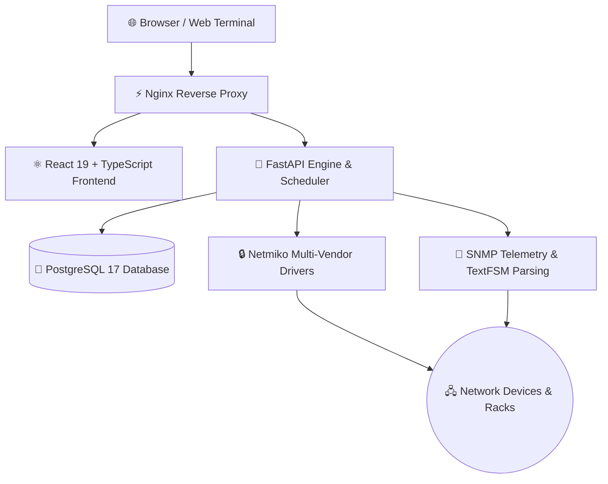

<div align="center">

# NEXORA

### Modern Network Operations Platform

**Everything your network team needs.**  
**One Platform. Total Network Control.**

`CMDB` • `IPAM` • `Monitoring` • `Automation` • `Configuration` • `Topology` • `Compliance` • `Audit`

<br/>

[](#-quick-start)
[](#-documentation)
[](#-roadmap)

<br/>

```text
═════════════════════════════════════════════════════════════════════════════════
 
                     ○───────────────○───────────────○
                     │               │               │
                  Device         Topology       Monitoring
                     │               │               │
                  ○───────────────○───────────────○
                     │               │               │
                    CMDB            IPAM         Automation
                     │               │               │
                  ○───────────────○───────────────○
 
═════════════════════════════════════════════════════════════════════════════════
```

</div>

<br/>

---

## Why Nexora?

Many organizations still maintain network inventory in spreadsheets, monitor devices using independent systems, back up configurations with separate tools, execute scripts from engineers' laptops, and document everything somewhere else.

As infrastructure grows, operational complexity grows even faster.

**Nexora was built to bring everything together.**  
A unified platform for network inventory, monitoring, automation, configuration management, topology, CMDB, IPAM, and operational workflows.

<br/>

```text
┌───────────────────────────────────────┐       ┌───────────────────────────────────────┐
│     Traditional Network Operations    │       │                 Nexora                │
├───────────────────────────────────────┤       ├───────────────────────────────────────┤
│                                       │       │                                       │
│  Inventory      ──────►   Excel       │       │    Inventory         Monitoring       │
│                                       │       │                                       │
│  Monitoring     ──────►   PRTG        │       │    Automation       Configuration     │
│                                       │       │           \               /           │
│  Configuration  ──────►   Oxidized    │  ──►  │            \             /            │
│                                       │       │             ▼           ▼             │
│  Terminal       ──────►   SecureCRT   │       │               NEXORA                  │
│                                       │       │             ▲           ▲             │
│  Documentation  ──────►   Wiki        │       │            /             \            │
│                                       │       │           /               \           │
│  Automation     ──────►   Python      │       │    CMDB            Topology           │
│                                       │       │                                       │
│          [ Disconnected Tools ]       │       │    IPAM             Reports & Audit   │
│                                       │       │                                       │
└───────────────────────────────────────┘       │         [ Everything Connected ]      │
                                                └───────────────────────────────────────┘
```

<div align="center">

> **Modern network operations should not rely on disconnected tools.**

</div>

<br/>

---

## Features / 核心特性

### 📦 Device Inventory (CMDB 资产与机架)
*   **Unified CMDB / 统一资产建模**：纳管网络硬件设备、板卡、接口和标签，全面覆盖设备物理生命周期。
*   **Rack Layouts / 三维机柜可视化**：提供 2D/3D 可视化机架拖拽、功耗和空间利用率计算，实现物理空间精准把控。
*   **Encrypted Credentials / 加密凭证安全**：设备 SSH 登录密码、Enable 密码和 SNMP 团体字在关系数据库中采用工业级高强度加密存储。

### ⚙️ Automation (网络自动化引擎)
*   **Concurrent CLI Execution / 多并发命令下发**：基于 Netmiko 的并发连接池，支持跨数百台设备进行定时或手动的批量 CLI 命令执行。
*   **Playbook Workflows / 剧本作业编排**：设计可视化变更工作流，按平台、设备角色自动生成定制脚本，实现网络自动配置。
*   **TextFSM Normalizer / 智能结构化解析**：内置多厂商 TextFSM 解析引擎，将复杂的设备回显输出（如 show/display 结果）自动归一化为标准的结构化 JSON 数据。

### 📈 Monitoring (实时遥测与监控)
*   **SNMP Interface Telemetry / 流量与链路遥测**：每隔数秒自动发起 SNMP 轮询，自动收集物理接口的实时流量、单播/非单播报文及带宽利用率。
*   **Dynamic Alarm Rules / 阈值告警联动**：支持 CPU、内存和接口利用率的自定义动态告警阈值配置，告警事件秒级响应并联动触发通知。
*   **Audit Traceability / 平台操作审计**：记录用户的每一笔变更操作和设备连接行为，保障日常运维安全合规。

### 📝 Configuration (配置备份与版本对比)
*   **Automated Backup / 定时配置备份**：自动定时备份交换机、路由器和防火墙的运行配置，生成历史版本基线。
*   **Visual Configuration Diff / 配置差异智能比对**：高亮直观展示任意两次备份配置之间的增、删、改差异，故障变更一目了然。

### 🗺️ Topology (物理拓扑自动发现)
*   **LLDP Discovered Links / 邻居拓扑自动发现**：通过 LLDP 数据链进行邻居发现与路径测绘，自动拼接和生成动态二三层网络物理拓扑图。

### 🌐 IPAM (三层子网与 IP 管理)
*   **Subnet Prefix Tree / 子网前缀树**：支持三层子网树状展现与 VLAN 划分，直观呈现 IPAM 资源分配进度及未分配空闲区间。
*   **Vlan & VRF isolation / VRF 与 VLAN 隔离**：支持多租户 VRF 空间隔离和 VLAN 跨站点管理。

### 📊 Reporting (运行分析报表)
*   **Statistical Reports / 自动巡检与分析报表**：导出全局设备健康度指标、子网分配率快照及资产合规扫描分析报告。

<br/>

---

## Architecture / 系统架构

Nexora 采用前后端分离的分层架构，通过 Nginx 反向代理统一入口，后端 FastAPI 引擎承担 API 服务、定时调度、设备接入和遥测采集，前端 React 19 + TypeScript SPA 提供全交互式操作体验。

| 层级 | 技术栈 | 职责 |
| :--- | :--- | :--- |
| **接入层** | Nginx Reverse Proxy | HTTPS 终结、静态资源分发、API 反向代理、WebSocket 透传 |
| **前端** | React 19 · TypeScript · Zustand · Recharts | 交互式仪表盘、拓扑可视化、Web Terminal、IPAM 前缀树、机架 3D 视图 |
| **后端引擎** | FastAPI · APScheduler · Pydantic | RESTful API、RBAC 鉴权、定时任务调度、配置备份、告警通知 |
| **设备驱动** | Netmiko · SNMP · TextFSM | 多厂商 SSH 连接池、CLI 命令并发执行、SNMP 遥测轮询、结构化解析 |
| **数据层** | PostgreSQL 17（生产）/ SQLite（开发） | CMDB 资产、凭证加密存储、IPAM 子网、遥测时序、审计日志、配置版本 |



<br/>

---

## Screenshots / 系统界面

<div align="center">

| **Dashboard** | **Device Inventory** |
| :---: | :---: |
| *Real-time operational overview & health status*<br/> | *Multi-vendor hardware & lifecycle management*<br/> |
| **Topology** | **Monitoring** |
| *Auto-discovered visual network map*<br/> | *Continuous SNMP telemetry & alert center*<br/> |
| **Configuration** | **Terminal** |
| *Automated backups & visual diff baseline comparison*<br/> | *Integrated secure Web SSH terminal*<br/> |

</div>

<br/>

---

## Quick Start / 快速部署

```bash
git clone https://github.com/libing28390-sketch/Release-netops.git
cd Release-netops
bash scripts/deploy-docker.sh install
```

<div align="center">

> **Ready in minutes.**

</div>

<br/>

---

## Environment Variables / 环境变量说明

部署项目时，请将 `.env.example` 复制为 `.env` 并按需调整参数值：

| 变量键名 | 功能说明 | 默认值 / 示例 |
| :--- | :--- | :--- |
| `DATABASE_URL` | PostgreSQL 生产关系型数据库连接字符串 | `postgresql://postgres:pwd@db:5432/netops` (回退为 SQLite) |
| `SECRET_KEY` | 用于 Web Session 签名及安全加盐，**生产部署必须修改** | `openssl rand -hex 32` 生成的高强度密钥 |
| `CREDENTIAL_ENCRYPTION_KEY` | 设备 SSH/SNMP 凭证（密码等）加密密钥，**必须修改** | `openssl rand -hex 32` 生成的高强度密钥 |
| `ENVIRONMENT` | 系统运行模式，可选 `production` (生产模式) 或 `development` | `development` |
| `CORS_ORIGINS` | 跨域来源访问白名单（逗号分隔） | 开发环境默认为 `*` |
| `MACHINE_ID_OVERRIDE` | 强制覆盖机器指纹（适用于容器漂移或 Codespaces 动态环境） | 自动智能检测 |
| `LICENSE_FILE_PATH` | License 授权文件存放路径 | `data/license.json` |
| `ALERT_NOTIFY_WEBHOOK_URL` | 告警事件联动触发的 Webhook 通知回调接口 | 空 (暂不触发) |
| `PLATFORM_URL` | 告警通知消息中“前往平台”按钮关联跳转的 URL 地址 | 空 |
| `TELEMETRY_RAW_RETENTION_HOURS` | 接口流量等原始遥测采样数据本地最长保留时长（小时） | `48` 小时 |
| `TELEMETRY_ROLLUP_RETENTION_DAYS` | 聚合后（按日/按周）的设备运行报表数据最长保留时长（天） | `365` 天 |

<br/>

---

## Directory Structure / 目录结构

```text
nexora-automation/
├── backend/
│   ├── api/                  # REST API 接口路由与权限校验
│   ├── core/                 # 系统全局配置、加密解密工具、RBAC 矩阵
│   ├── drivers/              # 网络设备多厂商 SSH 驱动 (Netmiko/Scrapli)
│   ├── engine/               # 自动化命令并发分发与 TextFSM 解析引擎
│   ├── database.py           # 数据库连接层 (PostgreSQL / SQLite 自动切换)
│   ├── main.py               # FastAPI 后端启动核心入口
│   └── requirements.txt      # 后端依赖包清单
├── src/                      # React 19 + TypeScript + Zustand 前端源码
├── nginx/                    # 生产反向代理、Nginx 服务配置与自签名证书
├── data/                     # 运行时持久化数据、日志输出与授权证书
├── backup/                   # 交换机配置文件自动定时备份存储目录
├── deploy-ubuntu.sh          # Linux (Ubuntu) 裸机一键部署自动化脚本
├── docker-compose.yml        # Docker 容器多服务编排文件
├── Dockerfile                # 多阶段容器构建规则
├── .env.example              # 环境变量模板文件
├── package.json              # 前端 npm 依赖与构建配置
└── vite.config.ts            # Vite 前端开发与构建配置
```

<br/>

---

## FAQ & Maintenance / 常见问题与维护排障

### 1. 如何升级系统至最新版本？
根据你的部署方式，选择对应的平滑升级操作：

#### ⚙️ Docker 容器化环境升级：
在部署目录中执行内置维护命令（升级操作会自动重新拉取代码并检测源码变更，数据不会丢失）：
```bash
# 执行平滑升级
bash scripts/deploy-docker.sh update
# 若需强制重构镜像
# bash scripts/deploy-docker.sh update --force
```

#### ⚙️ Ubuntu 原生 systemd 裸机升级：
```bash
cd /opt/nexora-automation
git pull
npm install && npm run build
pip install -r backend/requirements.txt
sudo systemctl restart netops
```

### 2. 部署完成后如何查看系统后台运行日志？
*   **systemd 环境**：`sudo journalctl -u netops -f`
*   **裸机常规进程**：`tail -f data/netops.log`
*   **Docker 容器环境**：`docker compose logs -f netops`

### 3. 在 GitHub Codespaces 等无 systemd 容器环境一键脚本启动失败？
一键安装脚本 `deploy-ubuntu.sh` 内置容器化环境检测。当发现没有 systemd 时，会自动回退使用系统 `service` 或以 `nohup` 守护方式在后台拉起 Python 和 Postgres 进程。如果在某些特殊云主机中失败，建议改用 **Docker Compose 一键部署**。

<br/>

---

## Documentation / 关联详细文档导航

*   **[Deployment Guide / 生产环境详尽部署指南](./DEPLOY.md)**：包含国内镜像网络加速、SSL/HTTPS 安全证书管理、数据卷持久化及安全防护。
*   **[Quick Start Guide / 快速开始](./docs/deploy/docker.md)**：5分钟利用 Docker 容器搭建本平台的保姆级教程。
*   **[User Manual / 关联功能用户使用手册](./docs/walkthrough/)**：设备资产录入指南、物理机架三维上架、自动拓扑关系图、配置 Diff 比较等。

<br/>

---

## Roadmap / 开发路线规划

| 规划版本 | 核心开发功能规划 | 当前状态 |
| :---: | :--- | :---: |
| **1.1** | **AI Copilot** —— 智能网络命令生成、AI 解析 CLI 输出与配置差异异常分析 | 🚧 *In Progress* |
| **1.2** | **Syslog Center** —— 系统核心 Syslog 日志采集服务、状态解析与实时追踪面板 | 📅 *Planned* |
| **1.3** | **Streaming Telemetry** —— 支持 gRPC 遥测数据流高速采集，实现秒级高频流量采样 | 📅 *Planned* |
| **1.4** | **RESTCONF / NETCONF** —— 多厂商网络设备标准接口对接与结构化 XML/JSON 下发 | 📅 *Planned* |
| **2.0** | **High Availability Cluster** —— 多节点分布式采集网络拓扑与高可用主备冗余引擎 | 📅 *Planned* |

<br/>

---

<div align="center">

## **Nexora —— One Platform. Total Network Control.**

</div>
