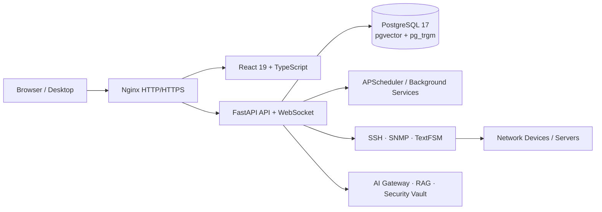

<div align="center">

# NEXORA

### 一体化网络运维与智能自动化平台

**从资产、地址、监控和配置，到终端审计、变更工单与 AI 知识引擎。**

`CMDB` · `IPAM` · `Monitoring` · `Topology` · `Automation` · `PAM` · `Change Management` · `AI / RAG`

[](https://github.com/libing28390-sketch/Release-netops)
[](https://github.com/libing28390-sketch/Release-netops/tree/windows)
[](#快速开始--quick-start)
[](LICENSE)

</div>

---

## 项目简介 / Overview

Nexora 面向网络运维团队，将分散在表格、监控系统、终端工具、脚本和知识文档中的工作统一到一个平台。系统以 CMDB 为数据基础，连接实时监控、告警、拓扑、IPAM、配置管理、自动化执行、PAM 审计、变更工单和 AI 知识检索，形成可追踪的运维闭环。

当前公开仓库由私有开发仓库通过 GitHub Actions 清理并同步：

- `main`：Ubuntu / Linux / Docker Compose 发布树。
- `windows`：Windows x64 图形化部署包与兼容启动器。
- 版本标签：生成 Linux / Windows ZIP 和对应 GitHub Release 制品。

> Nexora 会连接网络设备、执行命令并保存加密凭据。首次生产部署前，请先完成密钥替换、权限规划、数据库备份和网络访问控制。

## 当前功能模块 / Features

| 模块 | 当前能力 |
| :--- | :--- |
| **实时监控** | 运营总览、SNMP 设备与接口遥测、服务器监控、网络监控、互联网出口探测、健康趋势与运行状态汇总。 |
| **告警处置** | 告警工作台、历史告警、阈值与规则、维护期抑制、确认/关闭流程，以及飞书、钉钉、企业微信和通用 Webhook 通知。 |
| **网络拓扑** | 基于 LLDP/CDP、接口、VLAN、链路聚合等信息发现和归一化链路，提供交互式拓扑展示。 |
| **终端接入与 PAM** | SSH/Web 终端操作工作台、收藏和历史记录、一次性会话令牌、会话审计、录屏/回放、危险操作控制与管理员强制下线。 |
| **资产与 CMDB** | 网络设备、服务器、标签、站点、租户、设备/接口骨架、VRF、VLAN、资源检索、凭据中心，以及 2D/3D 机柜与容量视图。 |
| **网络事实库与诊断** | NSOT 网络事实库、ARP/MAC/路由等运行数据采集、IP 定位，以及 NPA 智能路径诊断。 |
| **IPAM** | Prefix 前缀树、IP 地址、地址池、VIP、DHCP 租约、利用率分析、IP 定位和多源对账。 |
| **配置管理** | 配置备份、备份计划、版本 Diff、全文搜索、漂移检测、配置模板与差异分析。 |
| **自动化与巡检** | 多设备并发 CLI、快捷操作、Playbook/场景编排、执行计划、定时作业、执行历史、巡检指标与记录、可管理的 TextFSM 解析模板。 |
| **变更工单** | 草稿、提交、初审、终审、实施、完成/失败/回滚等状态流转，支持分派、待办、关注、附件、模板和审批快照。 |
| **容量与报表** | 容量趋势分析、设备与资源统计、巡检和运行报表导出。 |
| **AI 中心与知识引擎** | Provider 管理、模型与场景路由、Prompt、Copilot、Agent 注册表、知识库采集与检索测试、产品目录、治理、Token 审计和 AI 安全网关。外部 AI 默认关闭，需管理员显式启用。 |
| **平台治理** | 用户与 RBAC、全局审计日志、凭据轮换、SNMP 指标模板、敏感信息脱敏和租户边界。 |

具体页面和操作会受版本授权、RBAC 角色、功能开关和运行环境影响。网络写入、密码轮换、外部 AI 和实验性 RAG 组件默认不开启或需要额外配置。

### 多厂商网络接入

设备能力通过平台注册表、Netmiko/Scrapli/SNMP 驱动和 TextFSM 模板统一管理。当前内置命令目录覆盖 Cisco IOS、Huawei VRP、H3C Comware、Juniper Junos、Arista EOS、Ruijie RGOS、ZTE、Raisecom、DPtech、Maipu 等平台；不同型号和系统版本的可用命令、解析字段及配置权限可能不同，上线前应使用测试设备验证。

## 系统架构 / Architecture



| 层级 | 主要技术 | 职责 |
| :--- | :--- | :--- |
| Web 前端 | React 19、TypeScript、Vite、Zustand、Recharts、D3、Three.js、xterm.js | 管理页面、图表、拓扑、3D 机柜和 Web 终端。 |
| API 与调度 | FastAPI、Pydantic、APScheduler、WebSocket | REST API、RBAC、任务调度、实时执行状态和终端通道。 |
| 网络接入 | Netmiko、Scrapli、SNMP、TextFSM | 多厂商 SSH/CLI、遥测采集、配置备份和结构化解析。 |
| 数据层 | PostgreSQL 17、pgvector、pg_trgm | 业务数据、审计、知识向量、全文检索和持久化。 |
| 接入网关 | Nginx | 前端静态资源、API/WebSocket 代理、HTTP/HTTPS 入口。 |

生产和发布环境仅支持 PostgreSQL；AI/知识库迁移还要求数据库具备 `vector` 与 `pg_trgm` 扩展。

## 快速开始 / Quick Start

### Docker Compose（推荐用于 Linux 服务器）

要求：Git、Docker Engine、Docker Compose v2、OpenSSL，以及可访问软件源/镜像源的网络环境。

```bash
git clone https://github.com/libing28390-sketch/Release-netops.git nexora-automation
cd nexora-automation
bash scripts/deploy-docker.sh install
```

脚本会创建 `.env`、生成初始密钥和数据库密码、构建 PostgreSQL/后端/Nginx 三个镜像并启动服务。完成后访问：

```text
https://<服务器IP>
```

首次启动会使用自签名 HTTPS 证书，浏览器可能提示证书不受信任；生产环境请替换为受信任的 CA 证书。完整步骤、离线镜像交付和升级说明见 [Docker Compose 部署](docs/deploy/docker.md) 与 [Docker 离线交付手册](docs/deploy/docker-release-manual.md)。

首次登录使用 `admin / admin`，登录后请立即修改密码。

### Ubuntu 原生部署

支持 Ubuntu 20.04 / 22.04 / 24.04（x86_64 / arm64）：

```bash
curl -fsSL -o /tmp/deploy-nexora.sh \
  https://raw.githubusercontent.com/libing28390-sketch/Release-netops/main/deploy-ubuntu.sh
chmod +x /tmp/deploy-nexora.sh
bash /tmp/deploy-nexora.sh
```

脚本会准备 PostgreSQL、Python、Node.js、systemd 和 Nginx。详见 [Ubuntu 一键部署](docs/deploy/ubuntu.md)。

### Windows x64

```powershell
git clone -b windows https://github.com/libing28390-sketch/Release-netops.git nexora-automation
cd nexora-automation
```

随后双击 `NetOps.exe`，按向导完成 PostgreSQL、pgvector、Python/Node.js 运行环境和前端资源初始化。默认本地访问地址为 `http://127.0.0.1:5010`。详见 [Windows 部署指南](docs/deploy/windows.md)。

## 部署后必做 / Security Checklist

1. 立即修改首次安装账号密码，并按 Viewer / Operator / Administrator 分配最小权限。
2. 确认 `.env` 中的 `POSTGRES_PASSWORD`、`SECRET_KEY` 和 `CREDENTIAL_ENCRYPTION_KEY` 均为独立高强度随机值。
3. 不要将 `.env`、数据库备份、设备配置、终端录屏、SSH/SNMP 凭据或 AI Provider Key 提交到 Git。
4. 将设备管理网、数据库端口和 Windows `5010` 端口限制在可信网段；生产流量通过 Nginx 和受信任的 HTTPS 证书接入。
5. 在启用自动化写操作、PAM、通知 Webhook 或外部 AI 前，先完成测试环境验证和审计策略配置。
6. 定期备份 PostgreSQL、配置快照和必要附件，并实际演练恢复流程。

## 常用配置 / Configuration

部署脚本会从 `.env.example` 初始化 `.env`。常用配置如下；完整清单和注释以 `.env.example` 为准。

| 变量 | 作用 | 默认/说明 |
| :--- | :--- | :--- |
| `POSTGRES_USER` / `POSTGRES_PASSWORD` / `POSTGRES_DB` | PostgreSQL 初始化账号、密码和数据库名 | 密码必须替换；Docker 安装脚本可自动生成。 |
| `DATABASE_URL` | 应用使用的 PostgreSQL 连接串 | Docker 内数据库主机为 `db`；裸机/本地常用 `127.0.0.1`。 |
| `SECRET_KEY` | Session 签名与安全加盐 | 生产必须使用随机值。 |
| `CREDENTIAL_ENCRYPTION_KEY` | 设备与集成凭据加密 | 生产必须使用独立随机值并安全备份。 |
| `AI_ENABLED` | AI 功能总开关 | 默认 `0`。 |
| `EXTERNAL_AI_ENABLED` | 是否允许外部 Provider 请求 | 默认 `0`，与 AI 安全策略共同生效。 |
| `AI_KILL_SWITCH` | AI 外部调用紧急熔断 | `1` 表示立即阻断。 |
| `NETWORK_WRITE_ENABLED` | 是否允许知识/AI 链路执行网络写操作 | 默认 `0`。 |
| `PRODUCTION_CREDENTIALS_ALLOWED` | 是否允许 AI/评估链路使用生产凭据 | 默认 `0`。 |
| `NETWORK_SSH_GLOBAL_CONCURRENCY` | 单进程 SSH 全局并发预算 | 默认 `20`。 |
| `NETWORK_SNMP_GLOBAL_CONCURRENCY` | 单进程 SNMP 全局并发预算 | 默认 `30`。 |
| `BACKUP_CONCURRENCY` | 配置备份并发数 | 默认 `10`。 |
| `TLS_COMMON_NAME` | 自动生成自签名证书时使用的名称 | 默认 `localhost`。 |

> 不要复用示例值。修改数据库密码时必须同步更新 `DATABASE_URL`；Provider Key 应通过加密管理页面或 Secret Manager 配置，不应写入仓库。

## 运维命令 / Operations

```bash
# 查看服务状态
docker compose ps

# 查看后端日志
docker compose logs -f netops

# 平滑同步并更新，保留 .env、数据卷和 nginx/ssl
bash scripts/deploy-docker.sh update

# 更新前先生成 PostgreSQL 与配置归档
bash scripts/deploy-docker.sh backup-release

# 停止服务（不删除数据卷）
docker compose down
```

`reset-data` 会删除当前 Compose 项目的数据卷、构建镜像和自动生成的 TLS 文件。除非已确认备份并明确需要重置，否则不要执行。

## 项目结构 / Repository Layout

```text
Release-netops/
├── backend/                 # FastAPI、服务层、设备驱动、AI/RAG 与数据库迁移
├── src/                     # React 19 + TypeScript 前端
├── assets/                  # 设备与 3D 资产目录
├── data/                    # 运行时目录及可管理的 TextFSM 模板
├── docker/postgres/         # PostgreSQL 17 + pgvector 镜像
├── nginx/                   # HTTP/HTTPS、静态资源与 WebSocket 代理
├── scripts/                 # Docker 部署、备份、离线交付和终端 Agent 脚本
├── docs/deploy/             # 各平台公开部署文档
├── docker-compose.yml       # Docker Compose 编排
├── deploy-ubuntu.sh         # Ubuntu 一键部署入口
├── DEPLOY.md                # 生产部署与安全说明
└── README.md                # 项目首页
```

## 文档 / Documentation

- [部署方式总览](docs/deploy/README.md)
- [生产部署与安全说明](DEPLOY.md)
- [Docker Compose 部署](docs/deploy/docker.md)
- [Docker 离线交付与升级](docs/deploy/docker-release-manual.md)
- [Ubuntu 原生部署](docs/deploy/ubuntu.md)
- [Windows 一键部署](docs/deploy/windows.md)
- [Windows pgvector 配置](docs/deploy/windows_pgvector_guide.md)
- [本地终端 Agent](docs/deploy/terminal-agent.md)
- [AI Provider、模型与安全网关配置](public/downloads/nexora-ai-provider-debug-manual.md)

后端启动后可在 `/api/docs` 或 `/api/redoc` 查看当前 API 文档；生产环境如不需要公开接口文档，应在网关层限制访问。

## Roadmap

- Syslog 中心与实时日志关联分析。
- gRPC Streaming Telemetry 高频采集。
- NETCONF / RESTCONF 标准化设备接口。
- 多节点采集与高可用部署。

Roadmap 仅表示方向，不构成版本承诺；当前版本能力以本仓库代码、Release Notes 和页面实际权限为准。

## License

本项目使用 [Apache License 2.0](LICENSE)。使用、分发和二次开发时请遵守许可证及第三方依赖的许可条款。

---

<div align="center">

**Nexora — One Platform. Total Network Control.**

</div>
